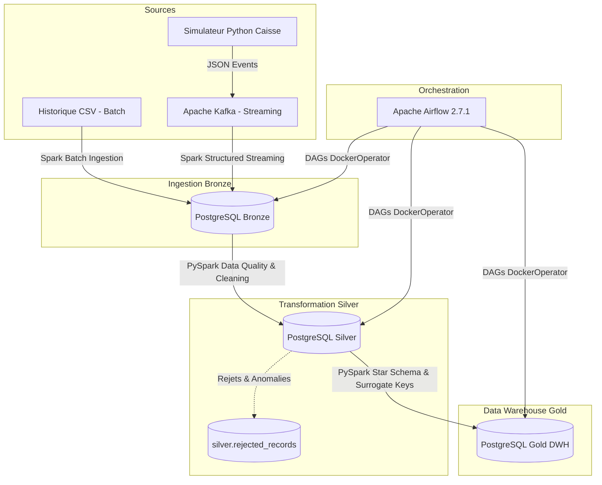

# RetailPlus — Modern Data Platform (Grande Distribution)

Plateforme de données moderne de bout en bout (**Data Platform**) conçue pour une chaîne de grande distribution marocaine (5 magasins physiques : Casablanca, Rabat, Marrakech, Tanger, Fès).

---

## 🏛️ Architecture Globale (Médaillon)

Le projet suit le pattern d'architecture **Médaillon (Bronze ➔ Silver ➔ Gold)** avec ingestion hybride (**Batch & Real-time Streaming**).



---

## 🛠️ Stack Technologique

- **Stockage & Data Warehouse** : PostgreSQL 15 (Schémas `bronze`, `silver`, `gold`)
- **Ingestion & Streaming** : Apache Kafka & Zookeeper (Confluent 7.4.0)
- **Traitement Distribué** : Apache Spark 3.5.9 (PySpark, Spark SQL, Structured Streaming)
- **Orchestration** : Apache Airflow 2.7.1 (LocalExecutor, DockerOperator)
- **Conteneurisation** : Docker & Docker Compose

---

## 📊 Modèle de Données (Couche Gold — Star Schema)

- **Dimensions** (`_sk` & `_nk`) :
  - `gold.dim_magasin` (5 magasins)
  - `gold.dim_fournisseur` (8 fournisseurs)
  - `gold.dim_produit` (500 produits référencés)
  - `gold.dim_client` (10 000 clients)
  - `gold.dim_temps` (2 557 jours : calendrier étendu 2024–2030)
- **Tables de Faits** :
  - `gold.fait_stock` (30 000 snapshots de stock)
  - `gold.fait_commandes` (2 000 commandes d'approvisionnement)
  - `gold.fait_lignes_commandes` (15 811 lignes de commande)
  - `gold.fait_ventes` (~3.83 Millions de tickets de vente)
  - `gold.fait_retours` (~80 000 retours articles)

---

## ⚡ DAGs Apache Airflow

1. **`dag_bronze_ingestion`** : Ingestion batch des fichiers CSV vers `bronze`.
2. **`dag_silver_transformation`** : Déduplication, validation e-mail, typage et isolation des rejets vers `silver.rejected_records`.
3. **`dag_gold_warehouse`** : Purge (`TRUNCATE CASCADE`), génération des SKs et chargement du Data Warehouse `gold`.
4. **`dag_retailplus_master`** : Pipeline E2E déclenchant séquentiellement les 3 DAGs via `TriggerDagRunOperator`.

---

## 🚀 Démarrage Rapide

### 1. Cloner le repository
```bash
git clone https://github.com/oussama-allouch/Retailplus-Project.git
cd Retailplus-Project
```

### 2. Démarrer l'infrastructure Docker
```bash
docker compose up -d
```

### 3. Accès aux interfaces Web
- **Airflow Webserver** : [http://localhost:8081](http://localhost:8081) (`admin` / `admin`)
- **Spark Master UI** : [http://localhost:8080](http://localhost:8080)
- **PostgreSQL DWH** : `localhost:5434` (`retailuser` / `retailpassword`)
